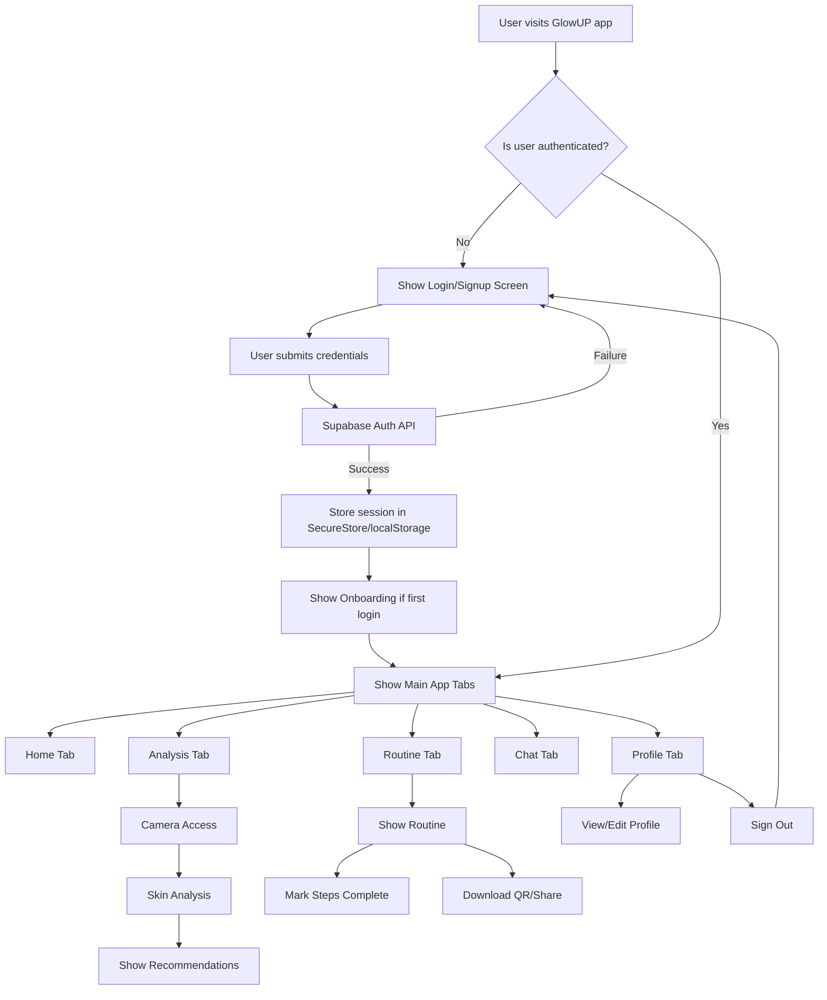

# ✨ GlowUp - Your AI Skincare Companion 🌿📱

> A next-gen **mobile-first skincare app** that helps Gen Z users analyze their skin, get personalized product recommendations, build routines, and track progress — powered by **AI, camera integration, and real-time personalization**.

<p align="center">
  
  
  
  
</p>

---

## 🌟 Key Features

| Category                 | Description                                                    |
| ------------------------ | -------------------------------------------------------------- |
| 🔐 **Authentication**    | Full login/signup with **Supabase Auth**, secure token storage |
| 📷 **Camera Support**    | Skin capture, **QR scanner**, and progress tracking            |
| 🧠 **AI Quiz Engine**    | Skin-type quiz + environment-based personalization             |
| 🧴 **Routine Builder**   | Drag-and-drop skincare routines with export & edit             |
| 📅 **Progress Calendar** | Before/after tracking, goal setting, and visual logs           |
| 🤖 **Glow Coach**        | AI chatbot with multiple personality modes                     |
| 🌘 **Dark/Light Mode**   | Smooth system-aware theming                                    |
| 📡 **Offline Ready**     | Local-first with **MMKV** and sync capabilities                |
| 🎨 **Design System**     | Consistent UI with custom fonts, animations, haptics           |

---

## 🔍 Use Case Overview

🎯 **Target Audience:**
Young skincare users (18–25) who seek personalized, science-backed skincare help.

🧩 **Solution Fit:**
GlowUp combines smart diagnostics, habit tracking, and product matchmaking in a single experience.

---

## 🧱 Tech Stack

| Layer              | Tech                                                              |
| ------------------ | ----------------------------------------------------------------- |
| 🛠️ Framework      | [React Native](https://reactnative.dev), [Expo](https://expo.dev) |
| 🔐 Backend         | [Supabase](https://supabase.com) (Auth + Realtime)                |
| 📷 Native Features | `expo-camera`, `expo-blur`, `expo-haptics`, `expo-status-bar`     |
| 💾 Local Storage   | `MMKV` for ultra-fast persistent storage                          |
| ⚙️ State           | React Context + Hooks                                             |
| 🌐 Web             | PWA-ready with `expo export --platform web`                       |
| 🧪 Testing         | Unit, integration & snapshot with Jest                            |

---

## 🗂️ Project Structure

```
├── app/                    # Pages & screens (Expo Router)
│   ├── (tabs)/            # Main navigation tabs
│   ├── auth.tsx           # Auth screen
│   ├── camera.tsx         # Skin/camera analysis
│   └── _layout.tsx        # Root layout
├── components/            # Reusable components (UI, camera, auth)
├── contexts/              # Global state providers
├── hooks/                 # Custom reusable hooks
├── lib/                   # API clients, constants
├── types/                 # Global TypeScript types
├── __tests__/             # All tests
```

---

## 🎨 Design System

| Element              | Style                                   |
| -------------------- | --------------------------------------- |
| 🎨 **Primary Color** | `#8B5CF6` (Violet)                      |
| 🌿 **Secondary**     | `#10B981` (Green)                       |
| 🔶 **Accent**        | `#F59E0B` (Amber)                       |
| 📚 **Typography**    | `Inter`, with fallback                  |
| 🧩 **Components**    | Buttons, cards, spinners, toasts, icons |
| 💬 **Icons**         | Lucide + Expo Icons                     |

---

## 🏗️ System Architecture

<!-- Generated with [Mermaid Live Editor](https://mermaid-js.github.io/mermaid-live-editor) -->


---

### ⚙️ How It Works

1. **Mobile App** triggers skin analysis through AI Quiz, Camera, and Environment data.
2. All inputs converge in the **Personalization Engine**.
3. This leads to tailored routines via the **Recommendation Module**.
4. User data is securely stored in **Supabase**, synced offline with **MMKV**.
5. Users can track progress and engage with the **Glow Coach** AI assistant.

---
## 📲 Screens & Navigation Flow

1. **👋 Onboarding** → Social signup/login
2. **🧠 AI Quiz** → Skin profile setup
3. **📷 Camera** → Scan or track skin changes
4. **🧴 Recommendations** → Personalized matches
5. **🛠 Routine Builder** → Interactive setup
6. **📆 Progress View** → History, photos, calendar
7. **🤖 Glow Coach** → AI skincare assistant
8. **👤 Profile** → Stats, settings, achievements

---

## 🚀 Quick Start

### 1️⃣ Clone & Install

```bash
git clone https://github.com/KrDevanshu06/GlowUP.git
cd GlowUP
npm install
```

### 2️⃣ Set Environment

```bash
cp .env.example .env
# Fill in your Supabase project details
```

### 3️⃣ Run It

```bash
npm run dev
# or `npm run ios` / `npm run android`
```

---

## 🌐 PWA & Web Support

✔️ Responsive Layout
✔️ Camera on Web (where supported)
✔️ Offline-ready with service workers
✔️ Installable like a native app

---

## 📈 Performance & Testing

* 🔍 Lazy loading of routes
* ⚡ Image optimization with `expo-image`
* 🧪 Snapshot + unit + integration tests
* 🧠 Error boundaries + crash reporting
* 🗂️ Bundle splitting & async imports

---

## 🔒 Security Highlights

* 🔐 Supabase-secured auth + tokens
* 🔑 SecureStore for session handling
* 🧼 Form validation + input sanitization
* 📡 HTTPS-first API calls

---

## 📊 Roadmap

✅ Authentication
✅ Camera-based skin analysis
✅ Personalized product matching
✅ Routine builder
✅ Dark/light mode
✅ Offline sync

🚧 Coming Soon:

* [ ] 🧬 AI-powered ingredient analyzer
* [ ] 🌍 Multi-language support
* [ ] 🤝 Social routine sharing
* [ ] 📊 Analytics Dashboard
* [ ] 🧠 Wearable data integration

---

## 👥 Contributing

1. Fork this repo
2. Create a feature branch
3. Commit with clear messages
4. Open a PR & follow code style

---

## 📝 License

[MIT License](LICENSE)

---

## 💬 Support

💡 Have feedback or need help?
Open an [Issue](https://github.com/yourname/glowup-app/issues) or start a [Discussion](https://github.com/yourname/glowup-app/discussions)

---

## 💖 Designed for Gen Z | Powered by AI

> A capstone project for **IIT Guwahati – Product Matters 5.0**
> Built to **reimagine skincare experiences for young users** using smart tech, design thinking, and personalization.
